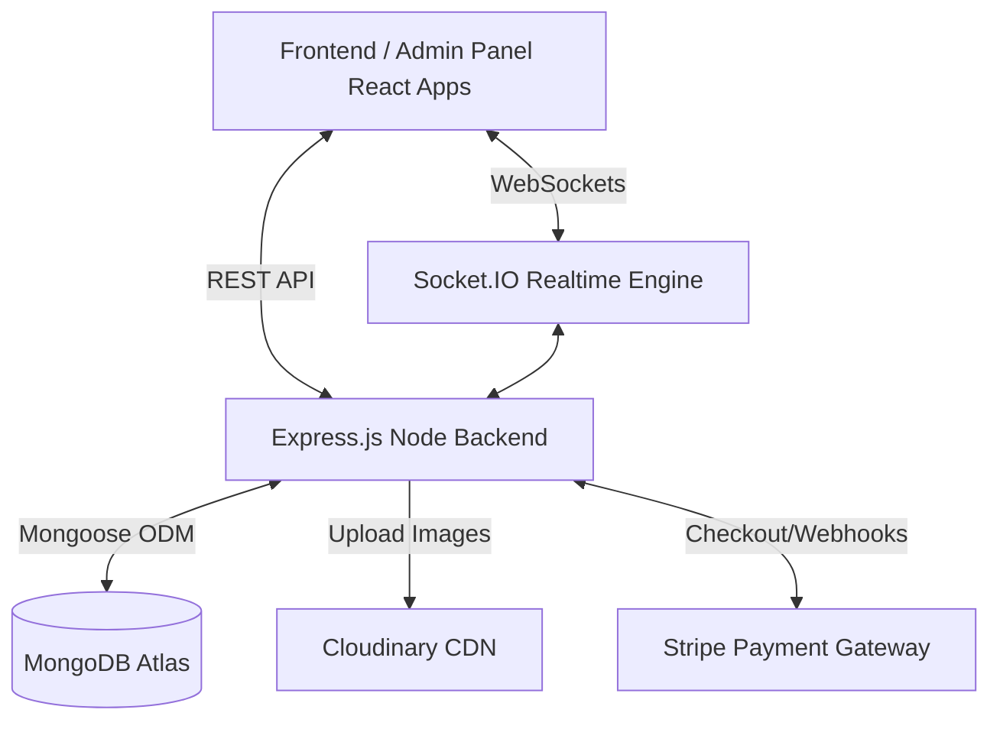

# Food Delivery App

A comprehensive Food Delivery Application built with the MERN stack (MongoDB, Express, React, Node.js). It includes a user-facing frontend for browsing food items and placing orders, an admin panel for managing orders and inventory, and a secure backend.

## 🚀 Features

- **Real-Time Order Tracking:** Synchronized immediately across the user and admin views using `Socket.io`.
- **Cloud Storage:** Image uploads are handled securely with Cloudinary to maintain backend statelessness.
- **Secure Authentication:** JSON Web Tokens (JWT) for secure authentication.
- **Rate Limiting:** Protects the login and registration APIs from brute-force attacks.
- **Stripe Integration:** For seamless checkout experiences.
- **Robust Architecture:** Adheres to RESTful principles and modern React context state management.

## 🏗 Architecture & Tech Choices

### System Architecture


- **Frontend:** React + Vite. Vite provides instant HMR and faster builds. State is managed via React Context API (`StoreContext`).
- **Backend:** Node.js + Express.
- **Database:** MongoDB via Mongoose.
- **WebSockets:** `socket.io` for event-driven real-time updates without polling.
- **Image Storage:** `Cloudinary` to ensure the Node server remains stateless (ready for Docker/Kubernetes deployment).

## 🛠 Local Setup & Installation

### Prerequisites
- Node.js (v18+)
- MongoDB connection string
- Cloudinary account
- Stripe account

### 1. Backend Setup
1. Navigate to the Backend folder: `cd Backend`
2. Install dependencies: `npm install`
3. Create a `.env` file based on `.env.example`:
   ```env
   PORT=5002
   MONGODB_KEY=your_mongo_url
   JWT_SECRET=your_jwt_secret
   STRIPE_SECRET_KEY=your_stripe_secret
   FRONTEND_URL=http://localhost:5173
   CLIENT_ORIGINS=http://localhost:5173,http://localhost:5174
   ADMIN_EMAIL=admin@admin.com
   ADMIN_PASSWORD=password
   CLOUDINARY_CLOUD_NAME=your_cloud_name
   CLOUDINARY_API_KEY=your_api_key
   CLOUDINARY_API_SECRET=your_api_secret
   ```
4. Start the server: `npm run dev`

### 2. Frontend Setup
1. Navigate to the Frontend folder: `cd Frontend`
2. Install dependencies: `npm install`
3. Create a `.env` file:
   ```env
   VITE_API_URL=http://localhost:5002
   ```
4. Start the frontend: `npm run dev` (Runs on port 5173)

### 3. Admin Panel Setup
1. Navigate to the Admin folder: `cd admin`
2. Install dependencies: `npm install`
3. Start the admin panel: `npm run dev` (Runs on port 5174)

## 🧪 Testing

The backend includes a suite of automated tests using `Jest` and `Supertest`. 

To run tests:
```bash
cd Backend
npm run test
```

## 📖 API Endpoints

### Auth / User Routes
- `POST /api/user/register` - Register a new user
- `POST /api/user/login` - Authenticate a user
- `POST /api/user/admin/login` - Authenticate admin
- `GET /api/user/profile` - (Auth) Get current user's profile

### Food Routes
- `POST /api/food/add` - (Admin) Add new food item (multipart/form-data)
- `GET /api/food/list` - Fetch all food items
- `POST /api/food/remove` - (Admin) Remove a food item

### Cart Routes (Requires Auth)
- `POST /api/cart/add` - Add item to cart
- `POST /api/cart/remove` - Remove item from cart
- `GET /api/cart/get` - Get user's cart

### Order Routes (Requires Auth)
- `POST /api/order/place` - Place a new order
- `POST /api/order/verify` - Verify Stripe payment
- `GET /api/order/userorders` - Get current user's orders
- `GET /api/order/list` - (Admin) List all orders
- `POST /api/order/status` - (Admin) Update order status
